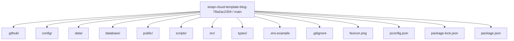
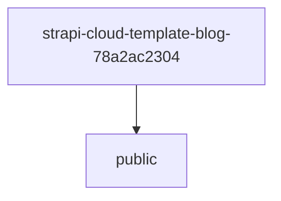
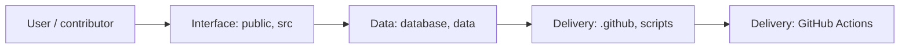
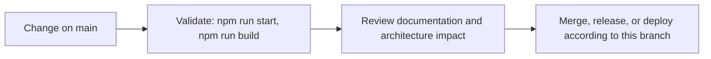

# Nischhal Strapi Blog Backend

<!-- interactive-readme-standard:start -->

> [!NOTE]
> **Branch-specific documentation:** this section is maintained for [`main`](https://github.com/Nischhalsubba/strapi-cloud-template-blog-78a2ac2304/tree/main). It is generated from the files present on this branch and preserves the project-authored README below.

<details open>
<summary><strong>Interactive repository guide</strong></summary>

## Branch overview

| Item | Value |
|---|---|
| Repository | [`Nischhalsubba/strapi-cloud-template-blog-78a2ac2304`](https://github.com/Nischhalsubba/strapi-cloud-template-blog-78a2ac2304) |
| Branch | [`main`](https://github.com/Nischhalsubba/strapi-cloud-template-blog-78a2ac2304/tree/main) |
| Detected stack | React, JavaScript, TypeScript |
| Detected manifests | package.json |
| Documentation policy | Every maintained branch must explain purpose, setup, structure, architecture, flows, testing, delivery, security, and ownership. |

## Repository structure



The diagram is generated from the branch's actual top-level files and directories. Use the branch link above for complete source navigation.

## Website or application structure



## Application and responsibility flow



## Change-to-delivery flow



## README requirements for this branch

- Explain what this branch contains and how it differs from the default branch.
- Keep installation, configuration, usage, testing, deployment, security, support, and license information accurate.
- Document repository, website or application, API, data, authentication, background-job, and deployment flows when they exist.
- Prefer Mermaid diagrams and expandable `<details>` sections for visual navigation.
- Link diagrams and modules to real source paths; never invent missing components.
- Preserve project-specific documentation and update diagrams whenever architecture or major paths change.
- Treat secrets, private infrastructure, customer data, and credentials as prohibited README content.

</details>

<!-- interactive-readme-standard:end -->

A Strapi 5 backend template for managing blog posts, authors, media, and API-delivered content.

## Stack

- Strapi `5.28.0`
- Users and Permissions plugin
- Strapi Cloud plugin
- SQLite for local development
- Node.js 18 through 22

## Local development

Install dependencies:

```bash
npm install
```

Start Strapi with auto-reload:

```bash
npm run develop
```

Build the admin panel:

```bash
npm run build
```

Run in production mode:

```bash
npm start
```

## Environment and secrets

Strapi requires environment-specific secrets and configuration. Never commit real values for:

- application keys
- API token salt
- admin JWT secret
- transfer token salt
- JWT secret
- cloud deployment tokens
- database credentials

Keep local secrets in ignored environment files and configure production secrets through the deployment platform.

## Content model notes

Before treating this as a finished CMS, document and review:

- post and author schemas
- slug uniqueness
- draft and publish behavior
- media permissions
- public API permissions
- role-based access controls
- input validation
- deletion and editorial workflows

## Seeding

An example seed command is available:

```bash
npm run seed:example
```

Review the seed script before running it. Do not seed real personal information or copyrighted content without permission.

## Deployment

```bash
npm run deploy
```

Confirm the target Strapi Cloud project and environment before deployment. A generated template is not automatically production-hardened merely because a cloud button exists. Humans remain involved, tragically.

## Status

This repository is a backend template and work in progress. It should not be described as a completed public blog platform until content models, permissions, backups, monitoring, and deployment configuration are verified.
