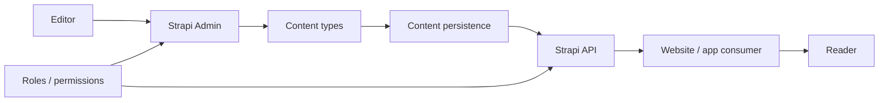
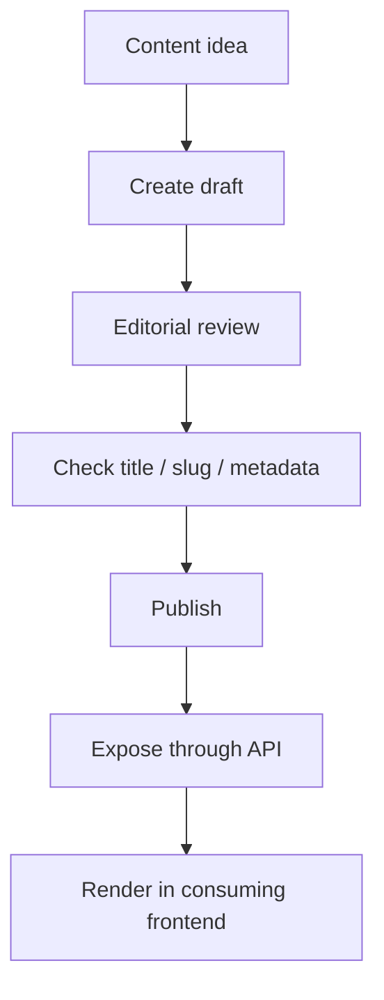
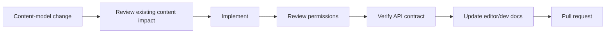

<div align="center">

# Strapi Cloud Blog Template

**A Strapi-based blog and content-management template for modeling editorial content, managing entries, exposing content APIs, and supporting a maintainable publishing workflow.**


[Browse source](https://github.com/Nischhalsubba/strapi-cloud-template-blog-78a2ac2304/tree/main) · [Issues](https://github.com/Nischhalsubba/strapi-cloud-template-blog-78a2ac2304/issues)

</div>

## Overview

This repository is a **Strapi blog/content template**. Editors work through the Strapi administration experience, content types define the editorial model, APIs expose permitted content, and a consuming frontend can render that content for readers.

| Audience | Focus |
|---|---|
| Editors | Create, review and publish structured content |
| Developers | Content types, APIs, configuration, permissions and deployment |
| Designers | Content-model needs, editorial states and frontend presentation contracts |
| Product / SEO teams | Metadata, URL strategy, structured content and publishing quality |

<details open>
<summary><strong>🏗️ Interactive CMS architecture</strong></summary>



</details>

## Publishing flow



## Getting started

```bash
git clone https://github.com/Nischhalsubba/strapi-cloud-template-blog-78a2ac2304.git
cd strapi-cloud-template-blog-78a2ac2304
```

Use the package manager indicated by the committed lockfile and the scripts in `package.json`. Keep environment secrets outside source control.

## Content, security & accessibility

Model content around editorial meaning rather than one page layout. Keep roles and API permissions minimal, validate public fields, protect credentials, and give frontends enough structured content for semantic headings, accessible media, meaningful links and usable error states.

## SEO & discoverability

A blog CMS should support unique titles and descriptions, stable slugs, canonical URLs, authors, publication/update dates, image alternatives, Open Graph data, Article structured data, sitemap generation and robots directives in the consuming frontend. Avoid turning every CMS field into an SEO field just because someone discovered a plugin menu.

## Contribution flow


