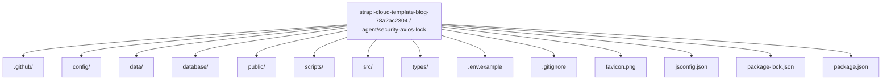
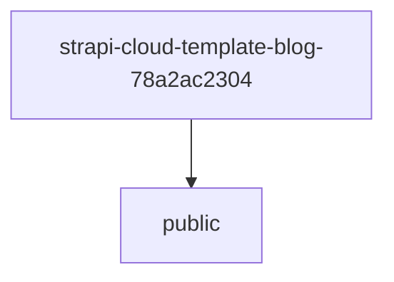
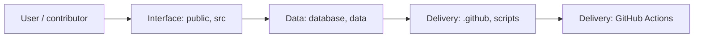
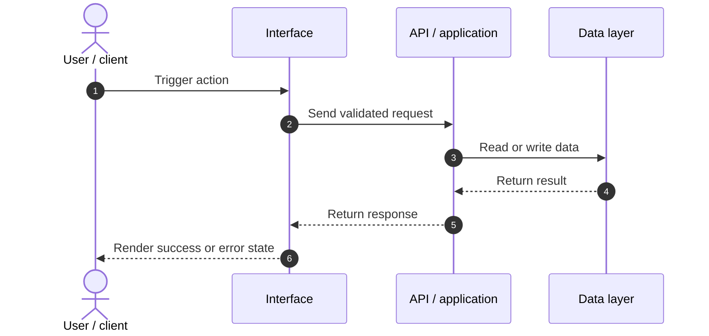
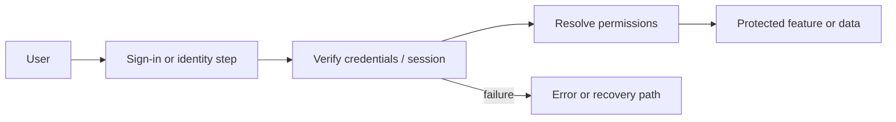
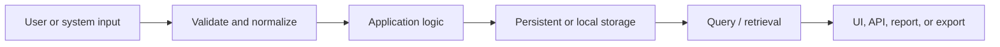
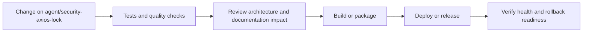
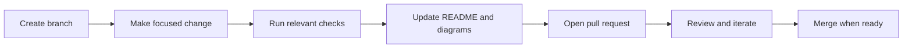

<!-- interactive-readme-standard:start -->

<div align="center">

# strapi-cloud-template-blog-78a2ac2304

**Branch-aware technical guide for [`agent/security-axios-lock`](https://github.com/Nischhalsubba/strapi-cloud-template-blog-78a2ac2304/tree/agent/security-axios-lock)**

<p>     </p>

<p>
  <a href="https://github.com/Nischhalsubba/strapi-cloud-template-blog-78a2ac2304/tree/agent/security-axios-lock"><strong>Browse source</strong></a> ·
  <a href="https://github.com/Nischhalsubba/strapi-cloud-template-blog-78a2ac2304/issues"><strong>Issues</strong></a> ·
  <a href="https://github.com/Nischhalsubba/strapi-cloud-template-blog-78a2ac2304/codespaces/new?ref=agent%2Fsecurity-axios-lock"><strong>Open in Codespaces</strong></a>
</p>

</div>

> [!IMPORTANT]
> This guide is generated from the files actually present on `agent/security-axios-lock`. It links to detected source paths, preserves project-authored notes, and avoids claiming components that were not found.

## At a glance

| Item | Detected value |
|---|---|
| Purpose | A Strapi 5 blog backend template for managing posts, authors, media, and API content. |
| Branch role | Compared with `main` |
| Stack | React, Strapi, JavaScript, TypeScript |
| Manifests | package.json |
| Prerequisites | Node.js |
| Delivery | GitHub Actions |
| License | No license file detected |

## Branch scope

No branch-specific file differences were detected against the default branch at generation time.


## Quick start

```bash
npm install
npm run start
npm run build
```

### Configuration surface

- `.env.example`

> Never commit secrets, private keys, production credentials, customer data, or unredacted infrastructure details.

## Repository map



| Responsibility | Detected source paths |
|---|---|
| Interface | [`public`](https://github.com/Nischhalsubba/strapi-cloud-template-blog-78a2ac2304/tree/agent/security-axios-lock/public), [`src`](https://github.com/Nischhalsubba/strapi-cloud-template-blog-78a2ac2304/tree/agent/security-axios-lock/src) |
| Data | [`database`](https://github.com/Nischhalsubba/strapi-cloud-template-blog-78a2ac2304/tree/agent/security-axios-lock/database), [`data`](https://github.com/Nischhalsubba/strapi-cloud-template-blog-78a2ac2304/tree/agent/security-axios-lock/data) |
| Delivery | [`.github`](https://github.com/Nischhalsubba/strapi-cloud-template-blog-78a2ac2304/tree/agent/security-axios-lock/.github), [`scripts`](https://github.com/Nischhalsubba/strapi-cloud-template-blog-78a2ac2304/tree/agent/security-axios-lock/scripts) |

## Website or application map



## Architecture and responsibility flow



<details open>
<summary><strong>Request lifecycle</strong></summary>



Detected API or server areas: [`src/api`](https://github.com/Nischhalsubba/strapi-cloud-template-blog-78a2ac2304/tree/agent/security-axios-lock/src/api).

</details>
<details>
<summary><strong>Authentication and authorization flow</strong></summary>



Relevant detected files: [`src/api/author/services/author.js`](https://github.com/Nischhalsubba/strapi-cloud-template-blog-78a2ac2304/blob/agent/security-axios-lock/src/api/author/services/author.js), [`src/api/author/routes/author.js`](https://github.com/Nischhalsubba/strapi-cloud-template-blog-78a2ac2304/blob/agent/security-axios-lock/src/api/author/routes/author.js), [`src/api/author/content-types/author/schema.json`](https://github.com/Nischhalsubba/strapi-cloud-template-blog-78a2ac2304/blob/agent/security-axios-lock/src/api/author/content-types/author/schema.json), [`src/api/author/controllers/author.js`](https://github.com/Nischhalsubba/strapi-cloud-template-blog-78a2ac2304/blob/agent/security-axios-lock/src/api/author/controllers/author.js).

> The diagram expresses the responsibility sequence only. Confirm exact providers, token formats, roles, and recovery behavior in the linked source.

</details>
<details>
<summary><strong>Data flow and model surface</strong></summary>



Detected data areas: [`database`](https://github.com/Nischhalsubba/strapi-cloud-template-blog-78a2ac2304/tree/agent/security-axios-lock/database), [`data`](https://github.com/Nischhalsubba/strapi-cloud-template-blog-78a2ac2304/tree/agent/security-axios-lock/data), [`config/database.js`](https://github.com/Nischhalsubba/strapi-cloud-template-blog-78a2ac2304/blob/agent/security-axios-lock/config/database.js), [`database/migrations/.gitkeep`](https://github.com/Nischhalsubba/strapi-cloud-template-blog-78a2ac2304/blob/agent/security-axios-lock/database/migrations/.gitkeep).

</details>

## Quality, security, and operations

<table>
<tr>
<td width="33%" valign="top">

### Quality

- No conventional test directory was detected automatically.

Detected commands:
- `npm run start`
- `npm run build`

</td>
<td width="33%" valign="top">

### Security

- No dedicated security policy or automated dependency configuration was detected.

Review authentication, authorization, input validation, dependency updates, secret handling, and failure recovery before release.

</td>
<td width="34%" valign="top">

### Observability

- No dedicated observability integration was detected automatically.

Define useful logs, metrics, traces, alerts, and rollback signals for production-facing branches.

</td>
</tr>
</table>

## Delivery flow



### Automation detected

- [`.github/workflows/apply-interactive-readme.yml`](https://github.com/Nischhalsubba/strapi-cloud-template-blog-78a2ac2304/blob/agent/security-axios-lock/.github/workflows/apply-interactive-readme.yml)

## Contribution flow



- Keep changes focused and explain architectural consequences.
- Run the checks relevant to the changed area.
- Update diagrams whenever routes, modules, data models, authentication, jobs, or delivery paths change.
- Add screenshots or recordings for visual behavior changes when useful.
- Use issues for reproducible defects and pull requests for reviewable changes.

## Ownership and support

| Topic | Source |
|---|---|
| Repository | [`Nischhalsubba/strapi-cloud-template-blog-78a2ac2304`](https://github.com/Nischhalsubba/strapi-cloud-template-blog-78a2ac2304) |
| Branch | [`agent/security-axios-lock`](https://github.com/Nischhalsubba/strapi-cloud-template-blog-78a2ac2304/tree/agent/security-axios-lock) |
| Ownership | No CODEOWNERS file detected |
| Contributing | Use the contribution flow above |
| Support | [Open or review issues](https://github.com/Nischhalsubba/strapi-cloud-template-blog-78a2ac2304/issues) |
| License | No license file detected |

<details>
<summary><strong>Documentation maintenance checklist</strong></summary>

- [ ] Purpose and branch scope are accurate.
- [ ] Setup and configuration commands still work.
- [ ] Repository, application, API, data, authentication, job, and deployment diagrams match the code.
- [ ] Tests, security controls, observability, and rollback behavior are documented.
- [ ] Links point to real files on this branch.
- [ ] No secrets or private operational details are exposed.

</details>

<!-- interactive-readme-standard:end -->

<!-- project-authored-notes:start -->
<details>
<summary><strong>Project-authored notes preserved from this branch</strong></summary>

# Nischhal Strapi Blog Backend

A Strapi 5 backend template for managing blog posts, authors, media, and API-delivered content.

## Stack

- Strapi `5.28.0`
- Users and Permissions plugin
- Strapi Cloud plugin
- SQLite for local development
- Node.js 18 through 22

## Local development

Install dependencies:

```bash
npm install
```

Start Strapi with auto-reload:

```bash
npm run develop
```

Build the admin panel:

```bash
npm run build
```

Run in production mode:

```bash
npm start
```

## Environment and secrets

Strapi requires environment-specific secrets and configuration. Never commit real values for:

- application keys
- API token salt
- admin JWT secret
- transfer token salt
- JWT secret
- cloud deployment tokens
- database credentials

Keep local secrets in ignored environment files and configure production secrets through the deployment platform.

## Content model notes

Before treating this as a finished CMS, document and review:

- post and author schemas
- slug uniqueness
- draft and publish behavior
- media permissions
- public API permissions
- role-based access controls
- input validation
- deletion and editorial workflows

## Seeding

An example seed command is available:

```bash
npm run seed:example
```

Review the seed script before running it. Do not seed real personal information or copyrighted content without permission.

## Deployment

```bash
npm run deploy
```

Confirm the target Strapi Cloud project and environment before deployment. A generated template is not automatically production-hardened merely because a cloud button exists. Humans remain involved, tragically.

## Status

This repository is a backend template and work in progress. It should not be described as a completed public blog platform until content models, permissions, backups, monitoring, and deployment configuration are verified.

</details>
<!-- project-authored-notes:end -->
